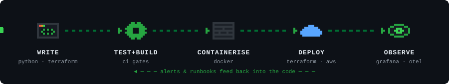

<div align="center">



</div>

**Freelance platform engineer & backend developer**, available for contract work.

I build backend services in **Python** and **TypeScript**, and I stay with them after the merge —
containerising them, shipping them to **AWS**, and wiring up the **Grafana / Prometheus / Loki / OpenTelemetry**
stack so that when something breaks at 3am, the dashboard says *where* before anyone has to guess.

Currently taking on work in: backend APIs, containerisation & deployment, CI/CD pipelines, and
observability setups for teams flying blind in production.
[**Hire me on Upwork →**](https://www.upwork.com/freelancers/~01c362d0288b459345)


## ▸ How my code reaches prod



Every stage above is something I've built for real, not aspirationally:

| Stage | What that means in my repos |
|---|---|
| **Write** | FastAPI + Django services, async pipelines on Celery/Redis, a Fastify server in TypeScript. Domain logic kept pure and unit-tested — [Focus-Den's core/](https://github.com/yashukun/Focus-Den) takes an explicit `now` so it never touches the clock or storage. |
| **Test + Build** | GitHub Actions running typecheck, tests and build on every push. Deploys only roll forward to the newest **CI-green commit** — a broken build physically can't ship. |
| **Containerise** | Dockerfiles with pinned Git-SHA build metadata, multi-service Compose stacks ([FixED](https://github.com/yashukun/FixED) runs 8 services with isolated networking), restart policies, volume-backed state. |
| **Deploy** | AWS Lightsail behind a TLS reverse proxy, provisioned by one **idempotent script** — the same command sets up a fresh box or updates a running one. Day-2 ops written down, not memorised. |
| **Observe** | Prometheus alerts on user-visible symptoms, Loki logs correlated to traces by ID, OpenTelemetry + Jaeger across services, Grafana dashboards split by audience. Incidents end as runbooks. |


## ▸ Proof of work

| | What it is | What it proves |
|---|---|---|
| **[Focus-Den](https://github.com/yashukun/Focus-Den)** | A shift tracker with a cozy pixel room — clock in, focus, earn points, grow your den. React/TS front, Fastify server, fully local data. | I can **build and operate** the whole thing solo: Docker image → CI gates → Lightsail → HTTPS → documented day-2 ops. |
| **[FixED](https://github.com/yashukun/FixED)** | RAG microservices platform: hybrid vector + lexical retrieval over textbooks, async ingestion, exam generation, SSE streaming. | Multi-service architecture under one Compose file — FastAPI, Qdrant, Celery, Redis, MinIO — with **token/cost observability** built in. |
| **[Django-Docker](https://github.com/yashukun/Django-Docker)** | Django, containerised the boring-good way. | The fundamentals: a clean, reproducible path from `manage.py` to a running container. |


## ▸ Stack

```yaml
languages:     [python, typescript, javascript, bash, sql]
backend:       [fastapi, django, node/fastify, celery, redis, rest, sse/websockets]
platform:      [docker, docker-compose, kubernetes, aws, github-actions, nginx/caddy, linux]
observability: [grafana, prometheus, loki, opentelemetry, jaeger, promql, slis/slos]
data:          [postgresql, elasticsearch, qdrant, minio, sqlite]
certified:     aws-cloud-practitioner   # → verify below
```

[](https://www.credly.com/badges/2c765ea7-224a-43df-ae7d-c51bcda7f821/public_url)


## ▸ The snake also eats my commits

<div align="center">

<picture>
  <source media="(prefers-color-scheme: dark)" srcset="https://raw.githubusercontent.com/yashukun/yashukun/output/snake-dark.svg" />
  <source media="(prefers-color-scheme: light)" srcset="https://raw.githubusercontent.com/yashukun/yashukun/output/snake.svg" />
  
</picture>


</div>


<div align="center">

**▸ PING ME**

[](https://www.upwork.com/freelancers/~01c362d0288b459345)
[](https://www.linkedin.com/in/yashukun/)
[](mailto:yashagarwal.cs@gmail.com)


```
░░░░░░░░░░░░░░░  P R E S S   S T A R T  ░░░░░░░░░░░░░░░
```

</div>
